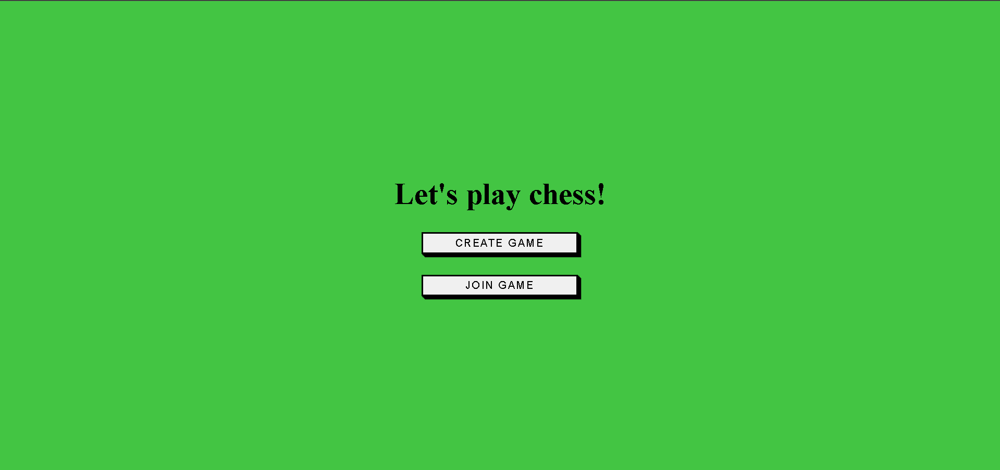
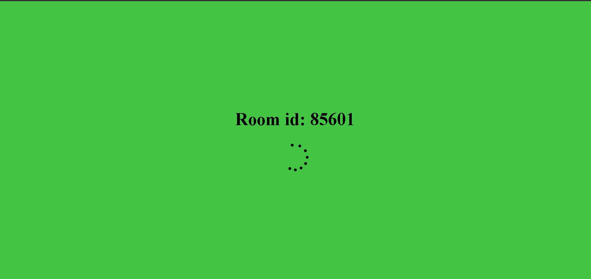
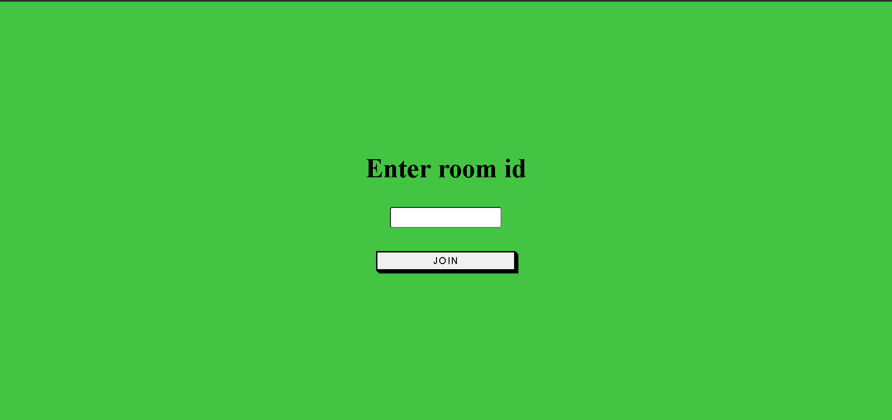
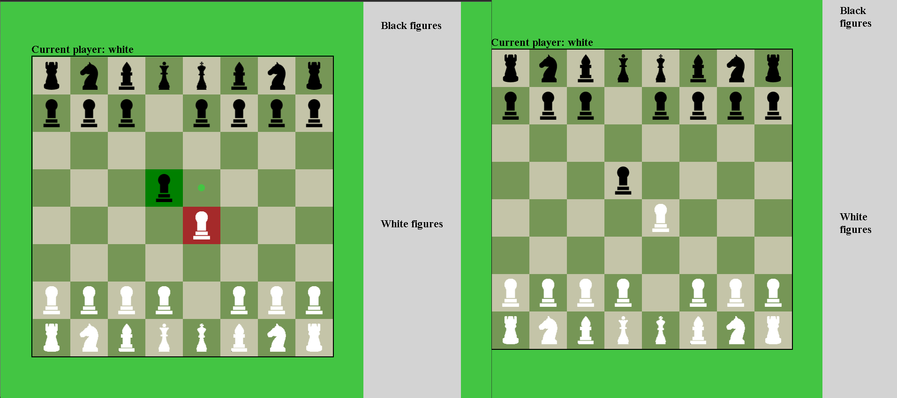

# Multiplayer chess

Multiplayer chess made with React, Node.JS, Express and Socket.io

Player creates room with random ID or join the room with existing ID.

The player who creates the room waits for another player to connect.

Another player should enter the ID of the room.

When both players connected the game starts.

## Features

All possible moves of the selected piece are highlighted. When in check, you can only move in such a way as to avoid the check. You can not make a move that will lead to a check from the opponent. If one of the players checks, the board is checked to checkmate.

